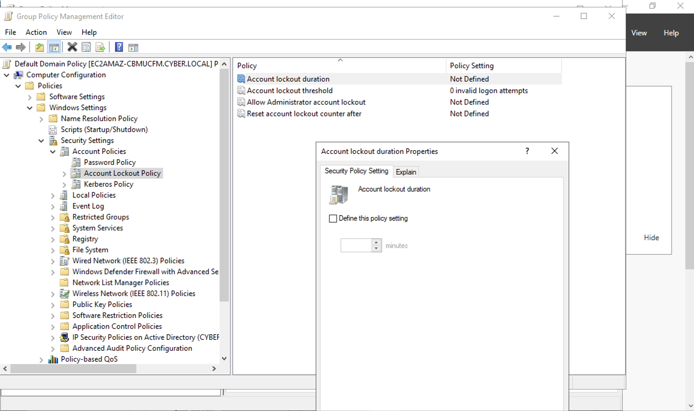

# Creating an Account Lockout Policy🔒
-This lab illustrates how to enforce **Account Lockout Policies**
### Account Lockout Policies
- On the top right of the main page of the AD server, click on **Tools** and then click on **Group Policy Management**
- In our example we're just going to link it to the **GPO** folder
- Next right click on the **GPO** folder tab, and select new, and name it **Account Lockout Policy**
- Navigate to **Computer Configuration** -> **Policies** -> **Windows Settings** -> **Security Settings** -> **Account Policies** -> and then click on **Account Lockout Policy**
- Click on that, and configure them as you see fit as well

## Demo Video🎥
-[Account Lockout Policy Config](https://www.loom.com/share/bdb50ec3be2c443684e0ef2fed26bf65?sid=50ef34dd-1242-41f8-b83d-6d8dc4e89f60)
